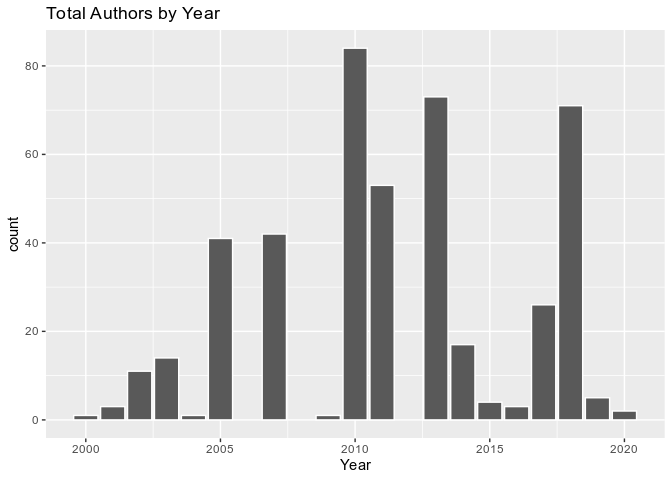
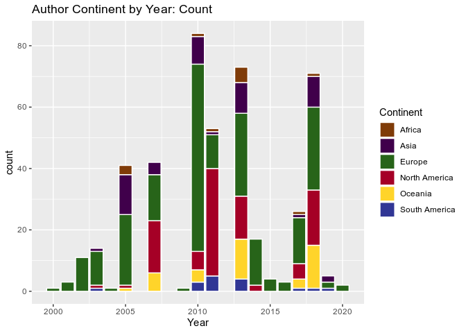

Geographies of Non-Communicable Diseases
================
James Millington
2020-08-05

  - [Aim](#aim)
  - [Analysis: Counts](#analysis-counts)
      - [Authors](#authors)
      - [Countries](#countries)
      - [Continents](#continents)
  - [Analysis: Temporal](#analysis-temporal)
      - [All Data](#all-data)
      - [Top 8 Authors](#top-8-authors)
      - [Top 20 Countries](#top-20-countries)
      - [Top 10 Countries](#top-10-countries)
      - [Continents](#continents-1)
      - [Institution Type](#institution-type)

## Aim

Analyse database of expertise on Non-Communicable Disease (NCDs)

**Questions**

1.  Who are the experts in the field?
2.  How has expertise changed over time?
3.  What are the geographies of expertise?

## Analysis: Counts

### Authors

<!-- --><!-- -->

### Countries

<!-- --><!-- -->
Maps (countries) by paper

<!-- --><!-- --><!-- --><!-- --><!-- --><!-- -->

    ## Creating frames

    ## ===========================

    ## =============

    ## =============

    ## ==============

    ## =============

    ## 
    ## Creating animation
    ## Animation saved to /home/james/OneDrive/Research/Papers/InProgress/Herrick_HealthNCD/Analysis/NCDGeographies/map_lancet_anim.gif

### Continents

<!-- -->

## Analysis: Temporal

### All Data

<!-- --><!-- --><!-- --><!-- --><!-- -->

### Top 8 Authors

<!-- --><!-- -->

### Top 20 Countries

<!-- --><!-- -->

### Top 10 Countries

<!-- --><!-- -->

### Continents

<!-- --><!-- -->

### Institution Type

<!-- --><!-- -->
